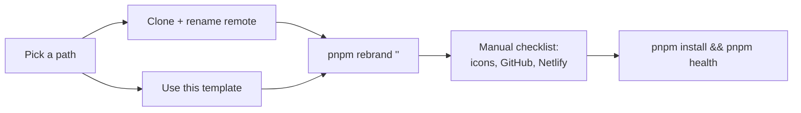

# Start a new product from this repo

This repo is two things at once: **a platform** (auth, RBAC, multi-tenancy, routing, CI/CD, agent-os, quality gates) and **one product built on it** (Core). This page is for the second case — you want the platform, not the product.

If you are joining work on Core itself, you want [setup.md](setup.md) instead.



---

## 1. Pick how you derive the repo

The choice matters for exactly one reason: **whether you can pull future platform fixes** (security patches, CI upgrades, agent-os improvements) from upstream.

| Path                                    | Command        | Keeps upstream link | Use when                                                                                                                                     |
| --------------------------------------- | -------------- | ------------------- | -------------------------------------------------------------------------------------------------------------------------------------------- |
| **Clone + rename remote** _(supported)_ | see below      | **Yes**             | You want platform updates. This is the path the rest of this doc assumes.                                                                    |
| **Use this template** (GitHub button)   | —              | **No**              | A throwaway spike or a hard fork you will never re-sync.                                                                                     |
| **Fork**                                | `gh repo fork` | Yes                 | You intend to contribute changes _back_ to the platform. Note GitHub marks the repo "forked from" and defaults new PRs to the upstream repo. |

Clone + rename keeps full history and a working `upstream` remote:

```bash
git clone https://github.com/nikunjmavani/core-fe.git acme-portal-fe
cd acme-portal-fe
git remote rename origin upstream
git remote add origin https://github.com/<your-org>/acme-portal-fe.git
```

> **The template button is intentionally a second-class path.** It produces a repo with no history and no upstream remote, so a later "pull the security fix from the platform" is a manual copy-paste. Only choose it if you are certain you never want that.

---

## 2. What a rename covers (read this before renaming)

**A rebrand is total.** The name is rewritten everywhere — package identity, CI, deploy targets, user-visible copy, **and prose in `docs/` and `agent-os/`**. A derived product keeps no trace of the name it came from, because a repo that half-says the old name reads as a mistake.

> **The cost, stated plainly.** Because prose diverges from upstream, `git merge upstream/main` will conflict across the renamed doc files on every platform update. That is the price of a clean repo, and it was chosen deliberately. If you would rather keep clean merges, don't run the prose pass — but then expect the old name to stay visible in your docs.

**What "everywhere" means precisely.** The sweep replaces two unambiguous tokens — the slug (`core-fe`) and the display name (`Core Frontend`). It does **not** blanket-replace the bare product word in prose, because `Core` is ordinary English: doing so rewrote "Core Philosophy", "Core Concepts", "Core Pattern" and — worst — "Core Layer", which names the `src/core/` architecture layer. User-visible branding never depended on that pass anyway; it comes from the 17 structural surfaces and the `{{productName}}` i18n variable.

**The backend is renamed too.** `core-be` becomes `<your-slug>-be`, on the assumption you fork the backend alongside the frontend — this repo names it in ~450 places (the `{ data, meta }` envelope comments, the E2E readiness probe, and `contracts:drift`). **After renaming, your backend checkout must sit next to this repo under the new name**, because `pnpm contracts:drift` resolves `../<backendName>/docs/routes.txt`; override the location with `$<SLUG>_BE_DIR`. To keep pointing at a differently-named backend, pass `--backend <repo-name>`.

Three things are **not** renamed, for reasons that are not branding:

| Not renamed                              | Why                                                                                                                                                                                                                                                                               |
| ---------------------------------------- | --------------------------------------------------------------------------------------------------------------------------------------------------------------------------------------------------------------------------------------------------------------------------------- |
| **`CHANGELOG.md`**                       | The releases in it genuinely happened under the old name. Rewriting history is a lie; your product's history starts at your first release.                                                                                                                                        |
| **Visual-regression baselines**          | 5 PNGs under `tests/e2e/visual.e2e.test.ts-snapshots/` render the previous brand. Only the dark ones exceed `maxDiffPixelRatio`, so the rest **pass while silently encoding the old logo** — regenerate the whole set with `pnpm test:visual:update` (needs the backend running). |
| **PWA PNG icons**                        | Binary; `rsvg-convert` regenerates them from `public/app-icon.svg`. The script prints the two commands.                                                                                                                                                                           |
| **Phrases that merely contain the name** | `Core Web Vitals` is Google's metric. A blanket rename invented a metric that does not exist across 14 files, so protected phrases are masked during the sweep — see `PROTECTED_PHRASES` in `tooling/identity/identity.mjs`.                                                      |
| **The bare product word in prose**       | `Core` is ordinary English — see the note above. Only the slug and the display name are swept.                                                                                                                                                                                    |

Once renamed, the old name is recorded in `project.previousNames`, and **`pnpm validate:identity` fails if it ever reappears** — through an upstream merge, a copy-paste, or a half-finished sweep.

---

## 3. Rebrand

One command rewrites every derived surface. It is a **dry run by default**:

```bash
pnpm rebrand "Acme Portal"
```

Review the preview, then apply:

```bash
pnpm rebrand "Acme Portal" --apply
```

Options:

| Flag                     | Default                                                    | Purpose                                       |
| ------------------------ | ---------------------------------------------------------- | --------------------------------------------- |
| `--name <repo-name>`     | derived from the product name, preserving the `-fe` suffix | package + repo name                           |
| `--repo <owner/repo>`    | current owner + new name                                   | GitHub slug                                   |
| `--owner <@handle>`      | unchanged                                                  | `CODEOWNERS` handle (`@user` or `@org/team`)  |
| `--description "<text>"` | unchanged                                                  | product description (meta tag + PWA manifest) |
| `--apply`                | off                                                        | actually write files                          |

### What it rewrites

The single source of truth is `tooling/setup/setup.config.json` → `project.*`. Everything below is derived from it, so you never edit these by hand:

- **App-facing** — the generated `src/lib/product-identity.ts` (imported by `page-head.ts`, `app-manifest.ts` and the i18n bootstrap), `public/manifest.webmanifest`, `public/app-icon.svg`, `public/offline.html` and `public/robots.txt`.
- **Repo + tooling** — `package.json`, `sonar-project.properties`, `typedoc.json`, `context7.json`, `catalog-info.yaml`, `docker-compose.sonar.yml`, `.github/release-please/config.json`, `.github/codeql/codeql-config.yml`.
- **Ownership + deploy** — `.github/CODEOWNERS`, `.github/environments/production.json`, the build artifact name and Netlify hostnames in `.github/workflows/reusable-netlify-deploy.yml`, and the PR preview hostname in `.github/workflows/preview.yml`.

Two surfaces are **not** in that list, because the brand was moved out of them entirely rather than rewritten:

- `index.html` — title, description, `theme-color` and the boot-splash name are `{{PRODUCT_*}}` tokens substituted at build time by `plugins/product-identity-html.ts`.
- `src/locales/**` — translated copy carries the `{{productName}}` interpolation variable, resolved from the identity block by `interpolation.defaultVariables` in `src/lib/i18n/i18n.ts`. The product name is identity, not translated content, so it lives in one place instead of 33 strings across 11 languages.

> **Why that matters.** The first version of this rebrand _did_ rewrite locale files key-by-key — and covered `brand.name` while missing `footerCopyright` and the onboarding question, so a renamed product shipped "© 2026 Core Platform" in its footer. `pnpm validate:identity` now runs a **completeness invariant**: it applies a fake rename to every surface and fails if the old name survives anywhere. A partial transform is worse than none, because drift stays clean and the rename reports success.

### What it does not cover

| Not covered                                                     | Why                                                                                                       | What to do                                                                                                                              |
| --------------------------------------------------------------- | --------------------------------------------------------------------------------------------------------- | --------------------------------------------------------------------------------------------------------------------------------------- |
| **PWA PNG icons** (`public/pwa-192x192.png`, `pwa-512x512.png`) | Binary; needs `rsvg-convert`                                                                              | Replace the artwork in `public/app-icon.svg`, then run the two commands the script prints                                               |
| **GitHub repo settings, Environments, secrets**                 | Needs credentials                                                                                         | Rename the repo, set description + homepage, then `pnpm github:sync`                                                                    |
| **Netlify site, Sentry + PostHog projects**                     | Needs credentials                                                                                         | Create each, then set `NETLIFY_SITE_ID` / `SENTRY_*` / `VITE_POSTHOG_*` in GitHub Environments — never in a committed file              |
| **`CHANGELOG.md` and git history**                              | It is the upstream platform's real release history                                                        | Leave it. Your product's history starts from your first release                                                                         |
| **The backend's own branding**                                  | `core-be` also carries the product name (for example the WebAuthn relying-party name and the TOTP issuer) | Rebrand the `core-be` repo separately — a full product rename is a two-repo exercise. The _name_ `core-be` stays either way (see above) |

---

## 4. Verify

```bash
pnpm install && pnpm agent-os:lock && pnpm health && pnpm validate:identity
```

`pnpm agent-os:lock` is required, not optional: the prose sweep edits files under `agent-os/skills/`, so the skills-lock hashes go stale and `agent-os-lock.policy.test.ts` fails until they are regenerated.

`pnpm validate:identity` is the durable half of this system. It runs in `pnpm health`, in `pnpm sync:check`, and as its own PR CI step, and it fails on two things:

1. **Drift** — a derived file no longer matching `setup.config.json`. Fix with `pnpm identity:sync`.
2. **A hardcoded brand literal** — the product or package name written as a string literal in `src/**` or `index.html`. Fix by importing from `@/lib/product-identity.ts`, or — if the occurrence genuinely is not branding — add the path with a reason to `tooling/validate/identity-allowlist.txt`.

That second check exists because this repo already proved the failure mode: before it landed, `setup.config.json` said the repository was `nikunjmavani/core-fe` while `catalog-info.yaml` said `core/core-fe` — two identity sources silently disagreeing, with only one product in existence.

---

## 5. Decide what to keep

The platform is everything under `src/core/`, `src/app/`, `src/shared/{auth,tenancy,errors,components/ui}`, `agent-os/`, `tooling/`, and `.github/`. Keep all of it.

`src/pages/` is a mix: the login/MFA/callback/onboarding/organization islands are the platform's own flows, while the dashboard's placeholder data and the billing surface are **sample product code** you will likely replace. Module-level switches live in `VITE_DISABLED_MODULES` (see `src/core/config/env-schema.ts`).

> A fuller "keep vs replace vs demo" inventory — the wrapper contract — is planned as a follow-up. Until it lands, `pnpm knip` and `pnpm validate:structure` are the practical guardrails: delete an island, run both, and they will tell you what you broke.

---

## 6. Keep receiving platform updates

```bash
git fetch upstream
git merge upstream/main
```

Because the rebrand deliberately leaves platform prose alone, conflicts are limited to the ~26 derived identity surfaces — and `pnpm identity:sync` re-derives all of them in one command after the merge.

---

## Related

- [setup.md](setup.md) — local development setup (running this app)
- [../reference/frontend-platform.md](../reference/frontend-platform.md) — what the platform kernel provides
- [../deployment/cicd-and-netlify.md](../deployment/cicd-and-netlify.md) — deploy pipeline you are inheriting
- [../../CLAUDE.md](../../CLAUDE.md) — project conventions
