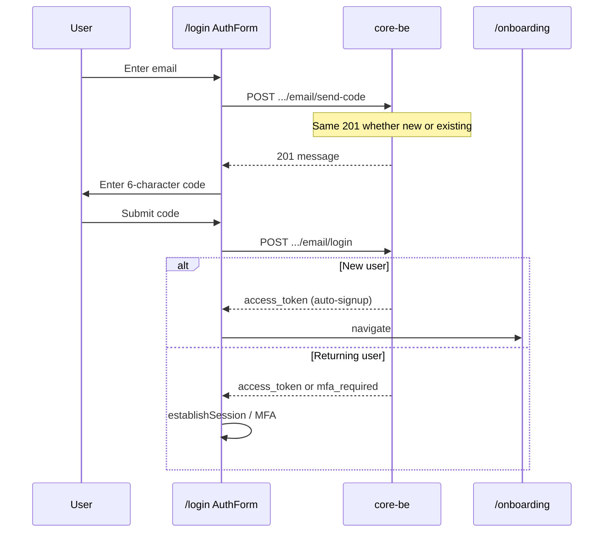

# Unified auth flows (login + signup)

How sign-in and sign-up work in core-fe today and which backend routes they target. **Requirement spec for BE changes:** [unified-auth-otp-requirement.md](../getting-started/requirements/unified-auth-otp-requirement.md).

---

## One screen, two intents

Users never choose “Sign in” vs “Sign up” on the unified auth screen. They pick a method (email, Google, GitHub, passkey) and complete it. The backend treats **send** and **verify** consistently:

| Phase                 | UX rule                           | Backend rule                                                           |
| --------------------- | --------------------------------- | ---------------------------------------------------------------------- |
| **Send OTP**          | Same copy and status for everyone | `201` + uniform body — **must not** leak whether the identifier exists |
| **Verify OTP**        | Same code entry UI                | Known user → session; unknown user → **auto-signup** + session         |
| **After verify (FE)** | New passwordless signup           | `/onboarding` then app; returning OAuth → `/` resolver                 |

Canonical URL: **`/login`** only — no separate register, forgot-password, reset-password, or verify-email routes.

Implementation: [`src/shared/forms/AuthForm/`](../../src/shared/forms/AuthForm/) mounted from [`LoginPage.tsx`](../../src/pages/login/LoginPage.tsx).

---

## Methods on `/login`

| Method          | Env flag(s)                                                                 | FE surface                        | Backend (target)                                         | Login + signup unified?            |
| --------------- | --------------------------------------------------------------------------- | --------------------------------- | -------------------------------------------------------- | ---------------------------------- |
| **Email OTP**   | `VITE_AUTH_EMAIL`                                                           | Default panel — email → code      | `POST /auth/email/send-code`, `POST /auth/email/login`   | Yes — auto-signup on unknown email |
| **Google**      | `VITE_AUTH_OAUTH_GOOGLE`                                                    | OAuth button → `/callback/google` | `GET /auth/oauth/google`, callback                       | Yes — OAuth creates/links user     |
| **GitHub**      | `VITE_AUTH_OAUTH_GITHUB`                                                    | OAuth button → `/callback/github` | `GET /auth/oauth/github`, callback                       | Yes                                |
| **Apple**       | `VITE_AUTH_OAUTH_APPLE`                                                     | OAuth button → `/callback/apple`  | `GET /auth/oauth/apple`, callback _(when core-be wired)_ | Yes                                |
| **Passkey**     | `VITE_AUTH_PASSKEY`                                                         | Passkey button                    | WebAuthn routes (501 until wired)                        | Yes                                |
| **Auto Google** | `VITE_AUTH_OAUTH_AUTO_GOOGLE` (requires `VITE_AUTH_OAUTH_GOOGLE` not false) | Delayed redirect unless cancelled | Same as Google OAuth                                     | Yes                                |

Email/password tabs are **not** on the unified screen — the app is OTP + OAuth + passkey only.

---

## Method button states (loading + disable)

Every method button on `/login` — OAuth (Google/GitHub/Apple), passkey, and the email
**Continue** / **Verify & continue** buttons — renders through one component,
[`AuthMethodButton`](../../src/shared/forms/AuthForm/components/AuthMethodButton/AuthMethodButton.tsx),
so they behave identically. **Do not** re-implement per-button loading/disable logic; add the
new method through `AuthMethodButton` and it inherits these rules:

- **Stable label** — the button text never changes while an action runs. The spinner is the only
  progress cue (no "Continuing…/Sending…/Verifying…" swaps — a label flicker reads as jank).
- **Leading icon → spinner** — the method icon is replaced by the spinner while loading, so there
  is never a double icon.
- **One spinner at a time** — only the clicked method spins; every other method is **disabled
  without a spinner**. Exactly one auth action is ever in flight (`AuthContinuePending`).
- **Captcha coupling is per-method** — pass `captchaGated` only for methods that need a Turnstile
  token (OAuth, email send/verify — not passkey). A gated button **disables without spinning**
  while a token mints. The Turnstile token is **single-use**, so submitting one method consumes it
  and the widget mints another in the background; that wait used to be drawn as a spinner on the
  button, which claimed the click was being processed when no request was in flight — after
  send-code, **Verify & continue** sat spinning and greyed out, and typing the code did not clear
  it (LOGIN-4). A spinner now means this method's own request, nothing else.
- **Method-specific disables** (invalid form, resend cooldown, incomplete code) go through
  `extraDisabled` — never a second loading path.

The captcha resolves **on intent** rather than gating the page, through
[`useCaptchaIntent()`](../../src/shared/auth/captcha/useCaptchaIntent/useCaptchaIntent.ts).
A gated button is never `disabled` for the captcha's sake: `ensureToken(key)` returns `true`
immediately when a token is already in the store — the overwhelmingly common path — and otherwise
reveals the challenge **at the control the user actually pressed** and waits up to
`CAPTCHA_CHALLENGE_WAIT_MS`, blocking the action with the reason on screen instead of silently.
A timed-out wait resolves `false` and the caller declines to act.

The challenge renders **inline** in a [`CaptchaSlot`](../../src/shared/auth/captcha/CaptchaSlot.tsx),
one per gated control, which renders only while `challengeFor` matches its own key — so the
challenge appears at that button rather than wherever a slot happened to be mounted. There is no
page-level gate notice and no captcha error banner: a control the user cannot press, cannot hover
for an explanation and cannot reach by keyboard — for a check they never started — was the problem
being solved, and gating both sign-in methods on one token closed every route into the product at
once whenever the widget was slow.

Cross-method state lives in [`auth-form-pending.ts`](../../src/shared/forms/AuthForm/auth-form-pending.ts)
(`authMethodIsLoading` / `authMethodIsDisabled` / `authEmailPanelIsBlocked`). Non-button surfaces
(email input, code entry, resend/change links) reuse those same helpers.

---

## Email OTP flow



**FE API today**

- Email: `authApi.emailVerificationCodeSend(email)` / `authApi.emailLogin({ email, code })`
  - `emailVerificationCodeSend` returns the parsed response body; under core-be’s
    local `TEST_MODE` it carries `debug_verification_code`, which the verify step
    auto-fills (dev convenience — the field never exists in a production response).

Constants: [`src/core/config/constants.ts`](../../src/core/config/constants.ts) → `EMAIL_CODE_SEND`, `EMAIL_CODE_LOGIN`. Both public routes accept optional `X-Captcha-Token` when Turnstile is enabled.

---

## Route map (FE pages vs APIs)

| FE route              | Role                       | Status                     |
| --------------------- | -------------------------- | -------------------------- |
| `/login`              | Unified auth (all methods) | **Keep** — single entry    |
| `/callback/$provider` | OAuth return only          | **Keep** — not for OTP     |
| `/onboarding`         | Post-signup wizard         | **Keep** — after OTP/OAuth |
| `/mfa`                | Second factor              | **Keep**                   |

---

## Environment toggles

OAuth provider buttons are **env-only** — the FE does not call `GET /auth/oauth/providers` or any public config API. Operators align FE `VITE_AUTH_OAUTH_*` with core-be OAuth credential env.

See [credentials-and-env.md](../integrations/credentials-and-env.md) and the [environment-variables runbook](../deployment/runbooks/environment-variables.md) — `VITE_AUTH_EMAIL`, `VITE_AUTH_OAUTH_GOOGLE`, `VITE_AUTH_OAUTH_GITHUB`, `VITE_AUTH_OAUTH_APPLE`, `VITE_AUTH_PASSKEY`, `VITE_AUTH_OAUTH_AUTO_GOOGLE`.

Resolved in [`auth-methods.ts`](../../src/core/config/auth-methods.ts) via `enabledOAuthProviders(authMethods.oauth)` and `useAuthMethods()`.

---

## Contract drift

FE endpoint paths must match `core-be/docs/routes.txt`. Run:

```bash
pnpm contracts:drift
```

When core-be changes auth routes, update `API_ENDPOINTS` and re-run drift + integration e2e.
